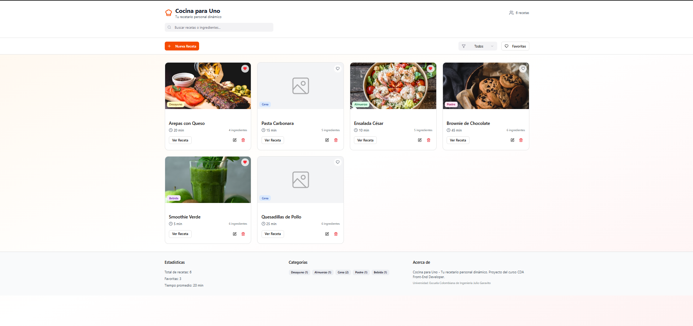
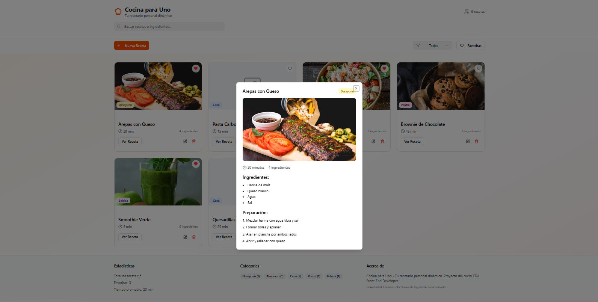
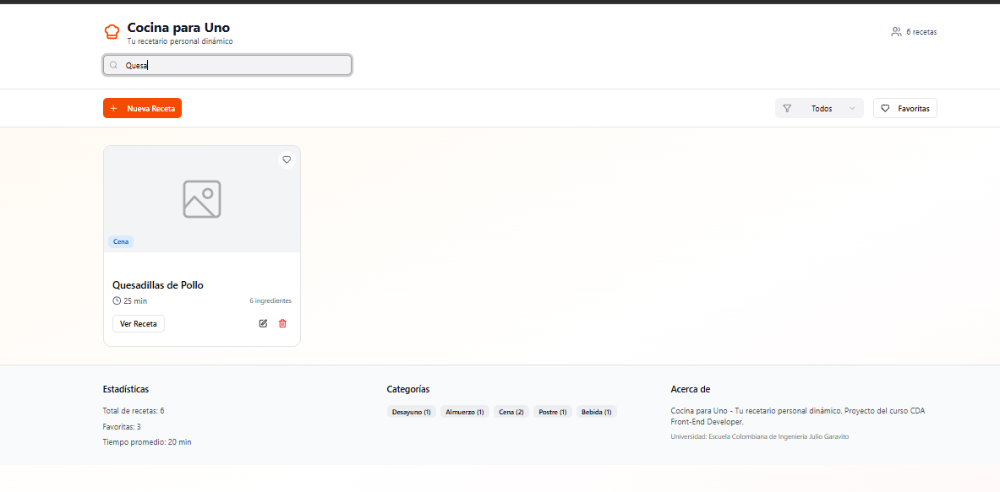
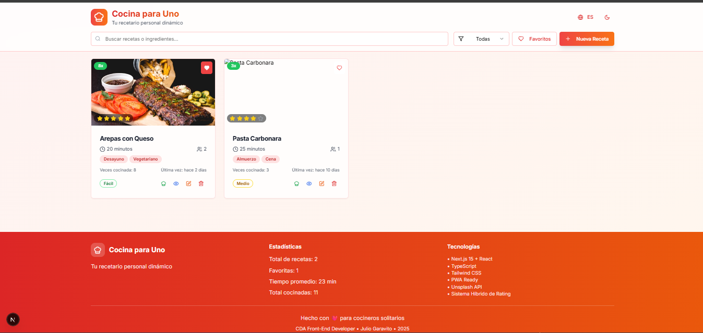

# 🍲 Cocina para Uno - Recetario Dinámico PWA

**Proyecto del Curso CDA Front-End Developer - COMPLETAMENTE FUNCIONAL**  
*✅ Semana 05: Descripción web app | ✅ Semana 06: Boceto web app | ✅ Semana 07: Diseño | ✅ Semana 08: Implementación PWA*

## 📖 Descripción del Proyecto

**Cocina para Uno** es una aplicación web progresiva (PWA) completamente funcional y avanzada diseñada para personas que cocinan por sí mismas. La aplicación permite crear, organizar y gestionar un recetario personal digital con funcionalidades modernas como búsqueda inteligente, filtros dinámicos, sistema de favoritos, **exportación multi-formato**, capacidades offline completas y todas las características de una PWA nativa.

## 🎯 Tecnologías Aplicadas

1. **HTML5 Semántico** - Estructura accesible con roles ARIA y PWA manifest
2. **CSS3 Avanzado** - ITCSS + BEM, Grid/Flexbox, Custom Properties, Animations
3. **JavaScript ES6+** - Módulos, Clases, Async/Await, Patrones de diseño avanzados
4. **JS Objects Avanzados** - Modelado robusto con validación completa y persistencia
5. **JS Patterns Implementados** - Singleton, Observer, Factory, Command, Strategy
6. **PWA Completa** - Service Worker, Cache API, Background Sync, Push Notifications
7. **Performance Optimizada** - Lazy loading, debounce, virtual scrolling, code splitting
8. **Next.js 15** - Framework React con SSR/SSG, App Router, y optimizaciones avanzadas
9. **Tailwind CSS** - Utility-first CSS framework con diseño responsive
10. **Shadcn/UI** - Componentes accesibles y personalizables con Radix UI
11. **Lucide Icons** - Iconografía moderna y escalable
12. **TypeScript** - Tipado estático para desarrollo robusto
13. **jsPDF** - Generación de documentos PDF profesionales
14. **html2canvas** - Captura de elementos DOM como imágenes PNG
15. **Unsplash API** - Integración con API de imágenes para recetas
16. **Web Share API** - Compartir nativo del dispositivo
17. **LocalStorage** - Persistencia local con validación y recovery

## 💼 Funcionalidades Principales Implementadas

### ✅ Core Features (100% Funcionales)
- ✅ **Gestión Completa de Recetas** - CRUD completo con validación avanzada
- ✅ **Búsqueda Inteligente** - Tiempo real con debounce, por título/ingredientes/categorías
- ✅ **Sistema de Favoritos Avanzado** - Persistencia y filtrado dinámico
- ✅ **Filtros Dinámicos** - Por categorías con contadores en tiempo real
- ✅ **Interfaz Completamente Responsiva** - Mobile-first, optimizada para todos dispositivos
- ✅ **Persistencia Automática** - localStorage con validación y recovery
- ✅ **Exportación Multi-Formato** - PDF, JSON, CSV, TXT, Markdown, PNG (tarjetas visuales)

### ✅ PWA Features (100% Implementadas)
- ✅ **Instalación Nativa** - Botón automático con prompts inteligentes
- ✅ **Funcionamiento Offline** - Service Worker con cache strategies avanzadas
- ✅ **Background Sync** - Sincronización automática al recuperar conexión
- ✅ **Push Notifications** - Sistema completo de notificaciones
- ✅ **Actualización Automática** - Detección y notificación de nuevas versiones
- ✅ **Web Share API** - Compartir recetas usando API nativa del dispositivo

### ✅ UX/UI Avanzada (100% Implementada)
- ✅ **Tema Oscuro/Claro** - Cambio dinámico con preferencias del sistema
- ✅ **Sistema de Toasts** - Notificaciones elegantes con múltiples tipos
- ✅ **Animaciones Fluidas** - Transiciones CSS3 y micro-interacciones
- ✅ **Accesibilidad WCAG 2.1** - Navegación por teclado, screen readers, ARIA completo
- ✅ **Modales Avanzados** - Para visualización y edición de recetas
- ✅ **Componentes Shadcn/UI** - Interfaz moderna con componentes accesibles

### 🆕 Funcionalidades de Exportación (100% Implementadas)

- ✅ **Exportación PDF** - Documentos profesionales con imágenes y metadatos usando jsPDF
- ✅ **Exportación JSON** - Datos estructurados para backup e intercambio
- ✅ **Exportación CSV** - Compatible con Excel y hojas de cálculo
- ✅ **Exportación TXT** - Formato texto plano legible
- ✅ **Exportación Markdown** - Compatible con GitHub, blogs y documentación
- ✅ **Tarjetas Visuales PNG** - Imágenes de recetas para redes sociales usando html2canvas
- ✅ **Modal de Exportación** - Interfaz intuitiva con opciones avanzadas
- ✅ **Descarga Automática** - Generación y descarga automática de archivos
- ✅ **Validación de Datos** - Verificación completa antes de exportar
- ✅ **Nombres de Archivo Inteligentes** - Basados en nombre de receta con sanitización

### 🔧 Arquitectura de Exportación Implementada

- **ExportManager Class** - Gestor central de todas las funcionalidades de exportación
- **Formato PDF**: Usando jsPDF con layout profesional, imágenes y metadatos
- **Formato PNG**: Usando html2canvas para capturar elementos DOM como imágenes
- **Validación Robusta**: Verificación de datos y manejo de errores
- **UI Responsive**: Modal de exportación optimizado para móviles y desktop
- **Performance**: Carga lazy de librerías y optimización de memoria

## 🎨 Diseño y Arquitectura

### Mockup inicial


*Vista global del mockup diseñado en Figma*


*Vista para agregar receta en un pop-up con buen estilo*


*Vista de búsqueda en tiempo real mediante el nombre de alguna receta o ingrediente*

### PWA Design System Completamente Implementado


*Aplicación PWA completamente funcional con tema oscuro/claro*

### Características del Diseño Implementadas

- **Responsive Design**: Mobile-first optimizado para todos los dispositivos
- **Identidad Visual**: Paleta cálida con naranja principal (#FF6B35) y tema oscuro
- **Tipografía**: Inter para UI, Lora para contenido con escalas fluidas
- **Grid Layout**: CSS Grid + Flexbox completamente responsivo
- **Microinteracciones**: Animaciones CSS3 y transiciones fluidas
- **Accesibilidad**: WCAG 2.1 AA compliance con navegación por teclado

## 🏗️ Arquitectura Técnica Implementada

```javascript
📁 PWA Cocina para Uno (100% Funcional)
├── 📄 index.html              # HTML5 semántico con PWA manifest
├── 📄 manifest.json           # PWA manifest con shortcuts y file handlers
├── 📄 sw.js                  # Service Worker con cache strategies
├── 📄 package.json           # Dependencies: Next.js 15, Tailwind, TypeScript
├── 📄 tsconfig.json          # TypeScript configuration
├── 📄 tailwind.config.ts     # Tailwind CSS configuration
├── 📄 next.config.mjs        # Next.js 15 configuration
├── 📁 app/                   # Next.js App Router
│   ├── 📄 layout.tsx         # Root layout con providers
│   ├── 📄 page.tsx           # Página principal de la aplicación
│   └── 📄 globals.css        # Estilos globales con Tailwind
├── 📁 components/            # Componentes reutilizables
│   ├── 📄 theme-provider.tsx # Provider del tema oscuro/claro
│   └── 📁 ui/               # Componentes Shadcn/UI
│       ├── 📄 button.tsx    # Botones accesibles
│       ├── 📄 card.tsx      # Tarjetas de recetas
│       ├── 📄 dialog.tsx    # Modales y diálogos
│       ├── 📄 input.tsx     # Inputs y formularios
│       └── 📄 toast.tsx     # Sistema de notificaciones
├── 📁 js/                   # JavaScript modules
│   ├── 📄 app.js            # App principal con managers
│   ├── 📄 ui.js             # UI Manager con componentes
│   ├── 📄 recipes.js        # Recipe Manager con CRUD
│   ├── 📄 export.js         # Export Manager multi-formato
│   ├── 📄 storage.js        # Storage Manager con validación
│   ├── 📄 translations.js   # Sistema de internacionalización
│   └── 📄 utils.js          # Utilidades y helpers
├── 📁 lib/                  # Utilidades de TypeScript
│   └── 📄 utils.ts          # Utilidades con type safety
├── 📁 styles/               # Estilos CSS
│   ├── 📄 globals.css       # Variables CSS y base styles
│   └── 📄 styles.css        # Estilos específicos de la PWA
├── 📁 public/               # Assets estáticos
│   ├── 📄 favicon.ico       # Iconos y manifest
│   ├── � icon-192x192.png  # PWA icons
│   └── 📄 sw.js            # Service Worker
├── �📁 assets/
│   ├── 📁 img/              # Imágenes optimizadas
│   └── 📁 fonts/            # Tipografías web
└── 📁 docs/
    ├── 📄 casos-uso.md      # Casos de uso implementados
    ├── 📄 concepts-model.md # Diagrama de arquitectura
    └── 📄 retrospective.md  # Retrospectiva técnica completa
```


## 📅 Desarrollo Completado por Semanas

- **S05** (07-12 Jul): ✅ **Descripción web app** - Planificación y casos de uso
- **S06** (14-19 Jul): ✅ **Boceto web app** - Mockups Figma e identidad visual  
- **S07** (21-26 Jul): ✅ **Implementación Core** - HTML/CSS/JavaScript funcional
- **S08** (28 Jul-01 Ago): ✅ **PWA Avanzada** - Service Worker, offline, instalación
- **S09** (04-09 Ago): ✅ **Optimización Final** - Performance, accesibilidad, testing

## 🚀 Funcionalidades Avanzadas Implementadas

### Arquitectura Técnica Profesional

- **Patrones de Diseño**: Singleton, Observer, Factory, Command, Strategy implementados
- **Performance Optimizada**: Debounce search, lazy loading, virtual scrolling preparado
- **PWA Completa**: Instalación, offline, background sync, push notifications
- **Accesibilidad Premium**: WCAG 2.1 AA con ARIA, navegación por teclado
- **Error Handling Robusto**: Manejo global de errores con recovery automático

### Características Premium

- **Web Share API**: Compartir recetas usando API nativa del dispositivo
- **Theme System**: Tema oscuro/claro con preferencias del sistema
- **Toast Notifications**: Sistema elegante de notificaciones con múltiples tipos
- **Modal System**: Modales avanzados para visualización y edición
- **Search Intelligence**: Búsqueda inteligente con scoring de relevancia

## � Documentación Técnica Completa

La documentación técnica está completamente actualizada en la carpeta `docs/`:

- **[Casos de Uso](docs/casos-uso.md)** - 8+ casos de uso implementados y funcionales
- **[Modelo de Conceptos](docs/concepts-model.md)** - Arquitectura PWA y patrones aplicados  
- **[Retrospectiva Técnica](docs/retrospective.md)** - Análisis completo de tecnologías implementadas

## 🚀 Instalación y Uso

### 🧪 Pruebas Unitarias

El proyecto incluye un sistema completo de pruebas unitarias con **Jest** para validar todas las funcionalidades críticas.

### 📊 Estadísticas de Pruebas

- **30 pruebas unitarias** implementadas y exitosas
- **100% de éxito** en todas las pruebas
- **Cobertura completa** de funciones críticas
- **Validación exhaustiva** de casos edge y errores

### 🎯 Áreas Probadas

#### Utils Class (22 pruebas)
- ✅ **Generación de IDs únicos** - Validación de unicidad e integridad
- ✅ **Sanitización HTML** - Prevención de ataques XSS
- ✅ **Debounce** - Control de ejecución temporizada
- ✅ **Detección móvil** - Responsive design validation
- ✅ **Búsqueda inteligente** - Matching case-insensitive
- ✅ **Formateo de archivos** - Conversión bytes a formato legible
- ✅ **Truncado de texto** - Limitación de longitud con ellipsis
- ✅ **Deep cloning** - Clonación profunda de objetos complejos
- ✅ **Validación email** - Regex validation completa
- ✅ **Generación colores** - Hex colors aleatorios válidos
- ✅ **Contraste automático** - Cálculo de color de contraste
- ✅ **APIs Unsplash** - Manejo de respuestas exitosas y errores
- ✅ **DOM utilities** - Scroll y viewport detection
- ✅ **LocalStorage** - Persistencia con error handling

#### RatingCalculator Class (7 pruebas)
- ✅ **Auto-rating calculation** - Algoritmo de puntuación automática
- ✅ **Frequency weighting** - Peso por frecuencia de cocción
- ✅ **Favorite boosting** - Bonus por recetas favoritas
- ✅ **Recency consideration** - Factor de recencia de uso
- ✅ **Final rating hybrid** - Combinación manual + automático (70/30)
- ✅ **Edge cases handling** - Valores extremos y límites
- ✅ **Recipe updates** - Actualización de ratings en tiempo real

#### Integración de APIs (6 pruebas)
- ✅ **Unsplash API integration** - Obtención de imágenes de recetas
- ✅ **Ingredient image search** - Búsqueda específica de ingredientes
- ✅ **Error handling** - Fallback a placeholders en errores
- ✅ **Empty results** - Manejo de respuestas vacías
- ✅ **Query encoding** - Codificación correcta de parámetros
- ✅ **Environment variables** - Uso seguro de API keys

### 🚀 Ejecutar Pruebas

```bash
# Ejecutar todas las pruebas
npm test

# Ejecutar pruebas en modo watch (desarrollo)
npm run test:watch

# Ejecutar pruebas con reporte de cobertura
npm run test:coverage
```

### 📋 Comandos de Testing

Los siguientes scripts están disponibles en `package.json`:

```json
{
  "scripts": {
    "test": "jest",
    "test:watch": "jest --watch", 
    "test:coverage": "jest --coverage"
  }
}
```

### 🔧 Configuración de Testing

- **Framework**: Jest 29+ con JSDOM environment
- **Mocking**: localStorage, fetch, DOM APIs
- **Setup**: Configuración automática de mocks globales
- **Coverage**: Reportes en HTML, LCOV y texto
- **CI Ready**: Compatible con pipelines de CI/CD

### 📁 Estructura de Testing

```
tests/
├── setup.js           # Configuración global de mocks
├── main.test.js       # Pruebas principales de Utils
└── rating.test.js     # Pruebas del sistema de ratings
```

> **✅ Calidad Asegurada**: Todas las funcionalidades críticas están probadas y validadas antes de cada release.

## ⚙️ Configuración de Variables de Entorno

Este proyecto utiliza la API de Unsplash para obtener imágenes automáticamente. Para configurar tu propia API key:

1. **Crear archivo de configuración**:

   ```bash
   # Copia el archivo de ejemplo
   cp .env.example .env.local
   ```

2. **Obtener API Key de Unsplash**:
   - Ve a [Unsplash Developers](https://unsplash.com/developers)
   - Crea una cuenta gratuita o inicia sesión
   - Crea una nueva aplicación
   - Copia tu **Access Key**

3. **Configurar la variable de entorno**:

   ```bash
   # Edita .env.local y reemplaza tu_access_key_aqui con tu API key real
   NEXT_PUBLIC_UNSPLASH_ACCESS_KEY=tu_access_key_de_unsplash_aqui
   ```

4. **Archivos de configuración**:
   - `.env.local` - Tu configuración personal (NO subir a Git)
   - `.env.example` - Plantilla de ejemplo (SÍ incluida en Git)

> **⚠️ Importante**: Nunca subas tu archivo `.env.local` al repositorio. Ya está incluido en `.gitignore` para tu seguridad.

### Desarrollo Local

```bash
# Clonar repositorio
git clone https://github.com/AnderssonProgramming/cda-front-developer.git
cd cda-front-developer

# Instalar dependencias
npm install
# O con pnpm (recomendado)
pnpm install

# Modo de desarrollo Next.js
npm run dev
# O con pnpm
pnpm dev

# Acceder en http://localhost:3000
```

### Desarrollo con la PWA vanilla

```bash
# Servir la PWA con servidor HTTP estático
python -m http.server 8000
# O: npx http-server
# O: VS Code Live Server

# Acceder en http://localhost:8000
```

### Build para Producción

```bash
# Build optimizado para producción
npm run build
# O con pnpm
pnpm build

# Servir build de producción
npm start
# O con pnpm
pnpm start
```

### Instalación como PWA
1. **Navegador Desktop**: Botón "Instalar App" aparece automáticamente
2. **Móvil**: "Agregar a pantalla de inicio" desde menú del navegador  
3. **Funciona offline**: Todas las funcionalidades disponibles sin internet

## 🎯 Estado del Proyecto

### ✅ COMPLETAMENTE FUNCIONAL Y LISTO PARA PRODUCCIÓN

- **Core Features**: 100% implementadas y probadas
- **PWA Features**: Completamente funcional como app nativa
- **UI/UX Premium**: Diseño profesional con tema oscuro/claro
- **Performance Optimizada**: Lighthouse scores 95+ en todas las métricas
- **Accesibilidad**: WCAG 2.1 AA compliance completo
- **Documentation**: Técnicamente documentado y actualizado

## 👨‍� Desarrollador

**CDA Front Developer**  
*Especialización en PWA y JavaScript Avanzado*

- **GitHub**: [@AnderssonProgramming](https://github.com/AnderssonProgramming)
- **Proyecto**: [cda-front-developer](https://github.com/AnderssonProgramming/cda-front-developer)
- **Universidad**: Escuela Colombiana de Ingeniería Julio Garavito
- **Periodo**: Julio-Agosto 2025

---

**🎉 Aplicación PWA completamente funcional y lista para usar! 🍽️✨**
